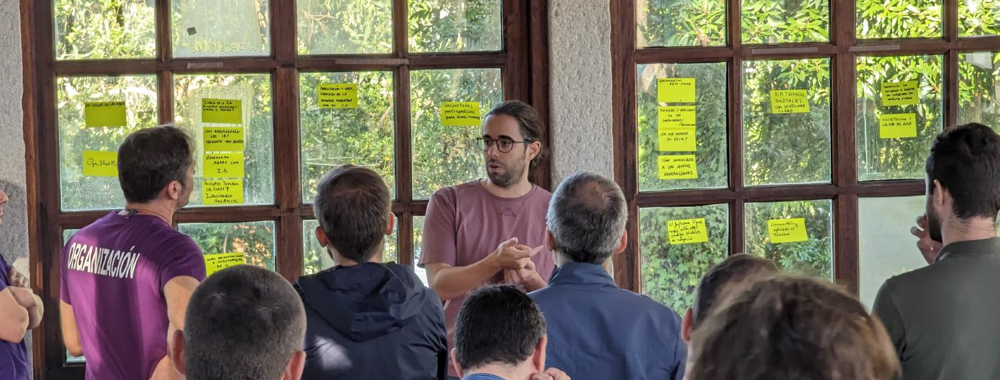
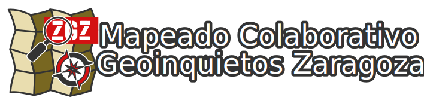
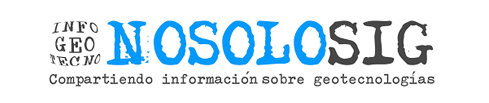

<!-- Logos en tema claro y oscuro -->

{.light .logo-geocamp}

{.dark .logo-geocamp}

## Datos importantes

* 📆 **Fecha**: Sábado, 13 de diciembre
* 📌 **Dónde**: [Etopia](https://www.zaragoza.es/sede/portal/etopia/), Zaragoza ( [OSM](https://www.openstreetmap.org/way/252382404))
* 🗒 **Registro**: _pronto_
{.no-bullets}

## Contacto

Puedes contactar con el equipo organizador de la GeoCamp/SotMes 2025 de varias formas:

* a través del correo [2025@geocamp.es](mailto:2025@geocamp.es?Subject=Contacto%20GeoCamp-SotMes%202025),
* abriendo un hilo en la discusión de [Github](https://github.com/geocamp-es/2025/discussions)
* también puedes preguntar a través del [grupo de Telegram](https://t.me/+s-M8b2nxP2hmNjFk) que tenemos sobre la jornada.

## ¿Qué es Geocamp/SotMes?

La **Geocamp** es el congreso anual del colectivo internacional Geoinquietos surgido del capítulo hipanohablante de [OSGeo](https://osgeo.org).

[**Geoinquietos**](https://geoinquietos.org) son grupos informales que se reúnen para conversar y aprender sobre cualquier tema relacionado con las ciencias geográficas, sus herramientas y los datos espaciales libres. No existe una estructura preestablecida, por lo que cada grupo se organiza a su manera, aunque comparten algunas características comunes como un foro de discusión, habitualmente una lista de correo, y una presencia en redes sociales. En Zaragoza se encuentra el grupo **Mapeado Colaborativo/Geoinquietos Zaragoza**, y puedes conocer sus actividades en su [web](https://mapcolabora.org).

La jornada que estamos preparando en Zaragoza será también la reunión para la **comunidad española de OpenStreetMap** íntimamente ligada con los colectivos de Geoinquietos. A estos congresos se los denomina **SotM**, del inglés *State of the Map*.

[**OpenStreetMap**](https://wiki.openstreetmap.org/wiki/ES:P%C3%A1gina_principal) es la plataforma colaborativa de datos espaciales libres por excelencia sobre la que se desarrollan una variedad de proyectos que se nutren de sus base de datos geográfica abierta y en la que cada día tenemos más colaboradores y sobre la que existen cada vez más datos para aprovechar de una manera libre e inesperada. La [**Asociación OpenStreetMap España**](https://openstreetmap.es) agrupa a buena parte de los colaboradores en esta parte del espacio geográfico y es la que co-organiza el evento.

**Si te interesa la geomática, las herramientas o los datos libres espaciales, esta va a ser una jornada para que compartamos conocimientos, experiencias y podamos conocernos en persona.**

<!--
Puedes consultar más información en esta [introducción a Geoinquietos](https://geoinquietosmadrid.github.io/geoinquietos-y-osgeoes/#/).
-->
- - -



## Patrocinadores

| Etopia - Centro de arte y tecnología | Ayuntamiento de Zaragoza |
| :--: | :--: |
|   |  |
{.logos}
| TomTom |
| :--: |
|  |
{.logos}
| Asociación QGIS España |
| :--: |
|  |
{.logos}

## Colaboradores

| Mapeado Colaborativo/Geoinquietos Zaragoza| NOSOLOSIG|
| :--: | :--: |
| ||
{.logos}
| TEconecta|
| :--: |
| |
{.logos}

## Organización

* [geoinquietos.org](https://geoinquietos.org)
* [openstreetamp.es](https://openstreetmap.es)

## Ediciones anteriores

* [Pamplona 2024](http://2024.geocamp.es/)
* [Vigo 2023](http://2023.geocamp.es/)
* [València 2019](http://2019.geocamp.es/)
* [Madrid 2018](http://2018.geocamp.es/)
* [Almería 2017](http://2017.geocamp.es/)
* [Barcelona 2016](http://2016.geocamp.es/)
* [Sevilla 2015](http://2015.geocamp.es/)
* [A Coruña 2014](http://2014.geocamp.es/)
* [Vigo 2013](http://2013.geocamp.es/)
